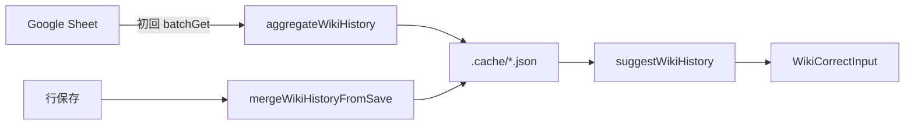

# シート履歴（Wiki History）

過去にシートへ記入された **正しいwiki** を学習し、編集時に候補として表示する機能です。

## 目的

Wiki 付与作業では `(name, wiki)` の組に対して **正しいwiki** URL を入力します。同じ組み合わせは過去行にも存在することが多いため、履歴から候補を出すと入力が速くなります。

## 学習対象

各 Wiki 三つ組 `(name列, wiki列, 正しいwiki列)` について:

| 条件 | 学習するか |
|------|-----------|
| name・wiki・正しいwiki がすべて非空 | ○ |
| 正しいwiki が HTTP(S) URL | ○ |
| 正しいwiki が空（Wiki 合致で不要な行） | × |
| name または wiki が空 | × |

三つ組の定義は `WIKI_TRIPLET_RULES`（`src/lib/config.ts`）にあり、Agent / Place / Patient-Theme / Territory 各セクションの列をカバーします。

## データの流れ



1. **初回候補取得 / ウォームアップ** — `GET /api/wiki-history` が呼ばれたとき、キャッシュに履歴がなければシート先頭 N 行（`indexRows`）から三つ組列を一括読取し、インデックスを構築します。アプリ起動・キュー読込時に空クエリで 1 回先行呼び出し（`indexRows` ごと）してインデックスを事前構築し、初回応答を高速化します。
2. **候補の先読み** — 行表示（三つ組の表示）時に各「正しいwiki」欄が自動で候補を取得（先読み）します。フォーカスを待たず判定を済ませるため、欄を開いた瞬間に候補が出ます。
3. **候補表示（バッジ→展開）** — 先読み結果は欄内に「候補 N 件」バッジ（候補が無ければ「履歴候補なし」）で示し、**バッジのクリックまたは textarea へのフォーカスでその欄のドロップダウンを展開**します（全欄同時展開による乱立を防止）。ドロップダウンはテーブルの overflow に隠れないよう `position: fixed` で欄直下に描画します。
4. **保存時更新** — 行保存で正しいwiki 列が更新された場合、キャッシュ上の履歴に 1 件マージします（Sheets 全体の再スキャンは不要）。

## 候補の優先順位

`suggestWikiHistory`（`src/lib/wiki-history.ts`）:

1. **exact** — name と wiki の両方が一致（正規化後）
2. **name** — name のみ一致（別 wiki だった過去行も参考になる場合）
3. 同一 correctWiki は 1 件にまとめる
4. 出現回数 `count` の多い順

入力中の文字列は `q` パラメータで correctWiki に部分一致フィルタします。

### 候補対象の値（URL / `-` / 空欄正解）

(name, wiki) に対する「正解」は次の3種類を候補にします（`isHistoryCorrectWikiValue` + 空欄正解判定）。

| 正解の種類 | 値 | 学習条件 | UI 表示 | 選択時に入る値 |
|---|---|---|---|---|
| URL | `https://...` | その行に記入があれば学習 | URL（タイトル付き） | その URL |
| 該当なし | `-` | その行に記入があれば学習 | 「「-」（Wiki該当なし）」 | `-` |
| Wiki値正しい | 空欄 | **作業 Status が完了系の行のみ**（未完了の空欄は未作業として無視） | 「Wiki値正しい」 | 空欄（欄をクリア） |

- 空欄正解は、`fetchWikiHistoryFromSheet` が作業 Status 列も読み（batchGet に1範囲追加）、完了行の空欄三つ組を学習します。保存時は **Status を完了に変更した保存でのみ**、空欄のままの三つ組を `mergeBlankCorrectEntry` で即時学習します。
- `-` 候補・空欄正解候補はリンクプレビューを取得しません。

## API

```
GET /api/wiki-history?name=...&wiki=...&q=...&indexRows=10000
```

レスポンス:

```json
{
  "suggestions": [
    {
      "correctWiki": "https://...",
      "name": "...",
      "wiki": "...",
      "match": "exact",
      "count": 3
    }
  ]
}
```

## キャッシュ

- 保存先: `.cache/{SPREADSHEET_ID}.json` の `wikiHistory` フィールド
- `indexRows` が UI の設定と一致しない場合は再構築
- `DELETE /api/cache`（キャッシュクリア）で履歴も削除

## 関連ファイル

| ファイル | 役割 |
|---------|------|
| `src/lib/wiki-history.ts` | 正規化・集計・検索・マージ |
| `src/lib/sheets.ts` | `fetchWikiHistoryFromSheet` |
| `src/lib/store.ts` | キャッシュ読書 |
| `src/lib/work-service.ts` | `ensureWikiHistory`, 保存時マージ |
| `src/components/WikiCorrectInput.tsx` | 候補 UI（先読み・件数バッジ・fixed ドロップダウン） |
| `src/app/api/wiki-history/route.ts` | API |

## 運用上の注意

- 初回構築は Sheets API の batchGet 1 回（三つ組数 29 × 3 列 = 87 レンジ × `indexRows` 行）が走ります。`indexRows`（既定 30000）が大きいほど時間・転送量が増えますが、**キャッシュ未構築時のみ**（以降は再利用）。三つ組は疎なため末尾空セルは API 側で省かれ、実転送はこれより小さくなります。読取が大きすぎて失敗する場合は batchGet の分割取得を検討。
- OAuth モードではログイン済みユーザーのトークン、未設定時はサービスアカウントで読み取ります。
- 履歴は **正しいwiki が記入された行だけ**（URL または `-`）から作るため、空欄行は候補に影響しません。
